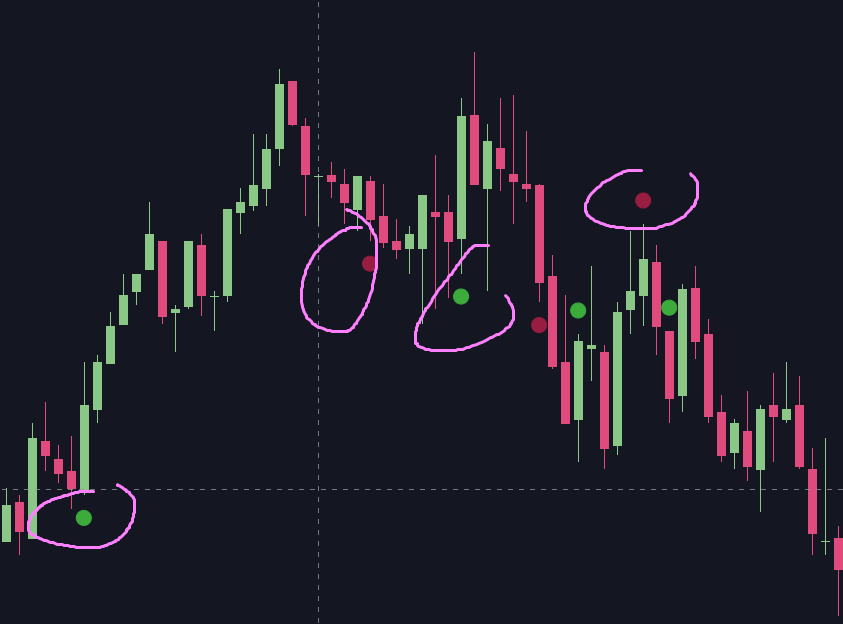
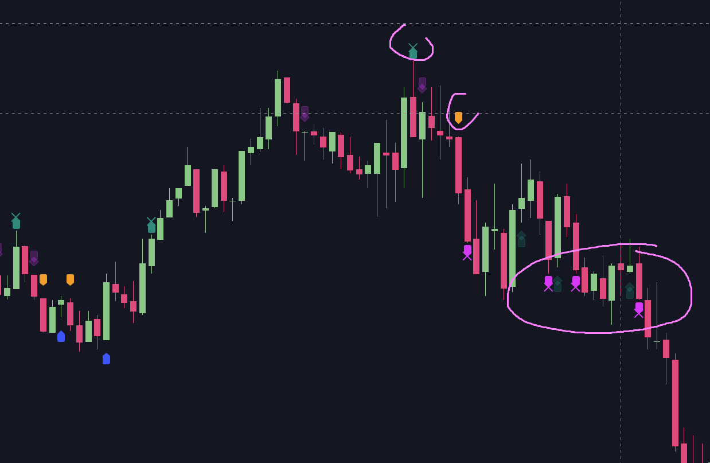
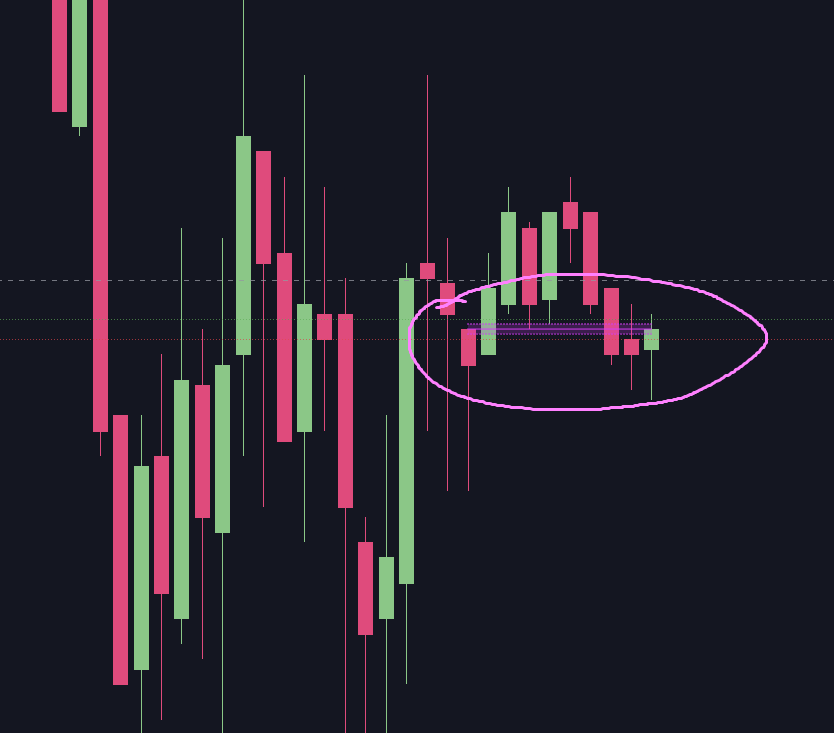
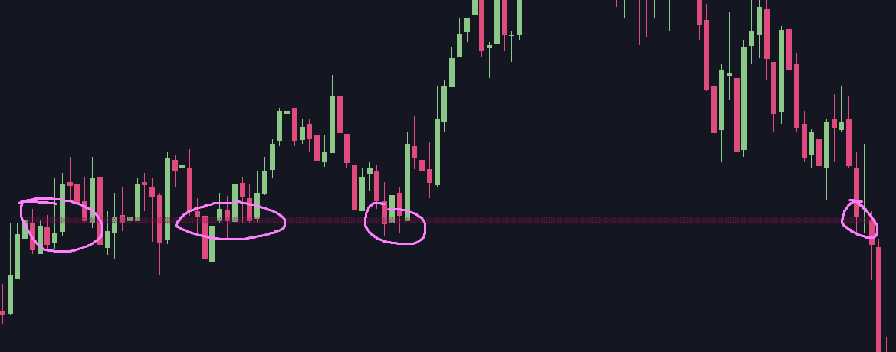
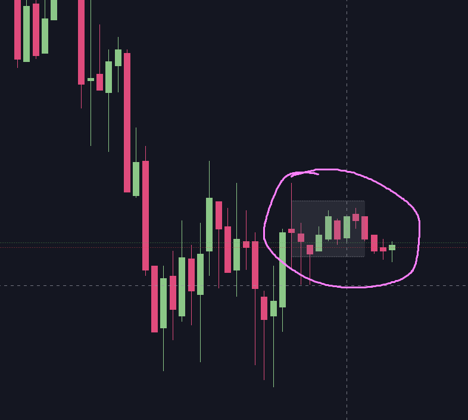
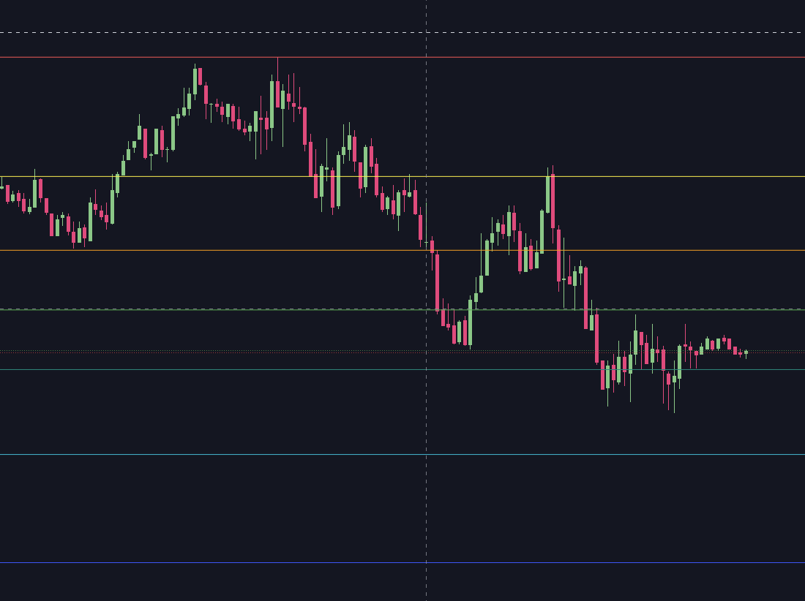

# 2024-04-21

> **Project is still going on**, but I need to fix one ugly _before the fall_ long I've placed, so
> it's a time for a little trading to reduce damages.

What's going on:
- I'm still researching most useful tools which would be included in PiPi
- Current set is: `Six Emas`, `CCI`, `Point-of-Interest`, `Simple Rotation Detection` and `Day Fibbonachi`
- Also, I've some idea in my mind to simplify the language, but I'm not sure, if it would be more readable
- _**So be please patient, the project is still on rails and going on.**_

## Six EMAs
This one tracks six EMAs from range (4, 8, 12, 16, 20, 24) and gives a signal when all of them are in the same direction or when the direction
is broken.

Example:

## CCI
I like CCI, this is default implementation and I see it's quite useful.

Example (all shown signals belongs to CCI):

## Point-of-Interest
Looks back for the price on the current candle, if it is somewhere in the history:
- Short term lookup (a few candles back)
- Long term lookup (quite a bunch candles back)

Short distance example:

Long distance example:

## Simple Rotation Detection
Takes current candle and searches for other candles to fit in the range. If it finds, it marks it as a rotation.

## Day Fibbonachi
Simple stuff: draws current day's high and low and fibbonachi levels.

Example:

