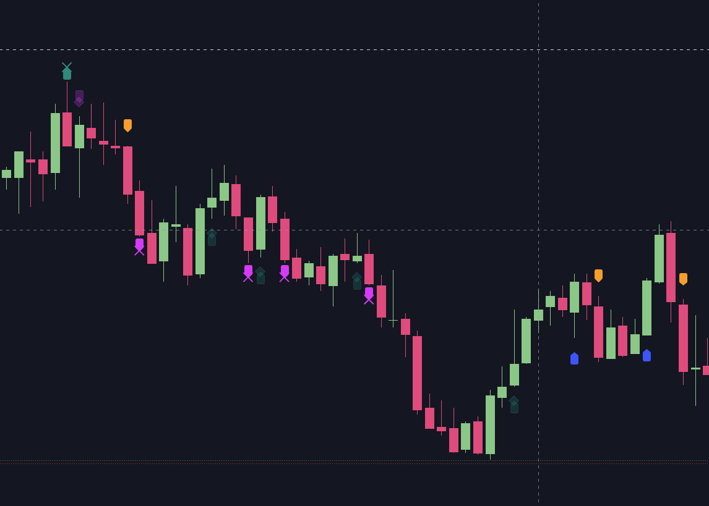
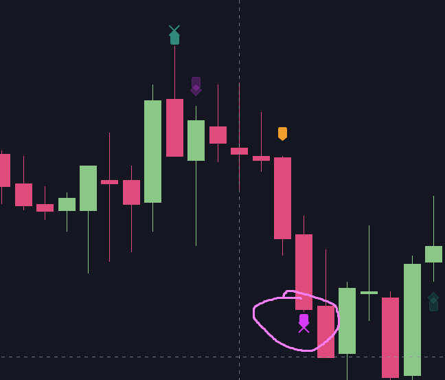
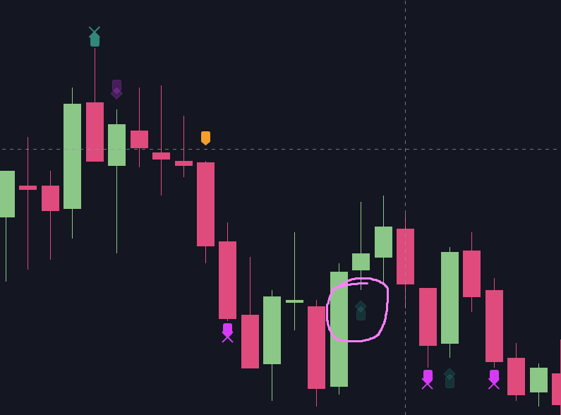
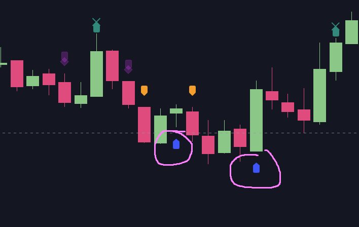
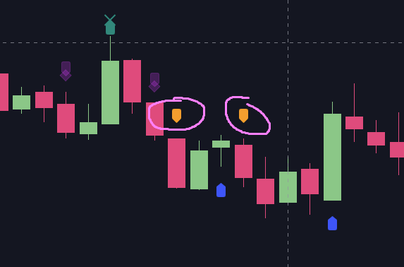
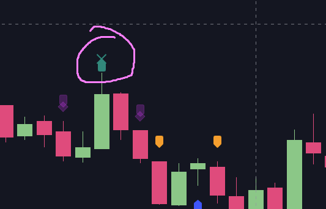
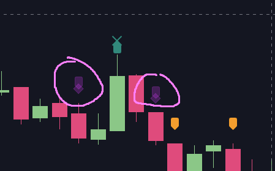

## CCI
This is default implementation of CCI (Commodity Channel Index) without any further modifications.

Example:

### How it works

Because CCI is an oscillator, I've used markers on the chart to show the signals.

Basically you can read what's happening from the markers - if there is overbought/oversold state and also where the signal is going (from overbought to zero
to oversold, or jumping around or whatever).

It's possible to get the reversal point using this indicator (with a price action).

The signals are:

Signal enters < -100 zone:

Signal exits < -100 zone:

Signal crosses over zero:

Signal crosses under zero:

Signal enters > 100 zone:

Signal exits > 100 zone:

