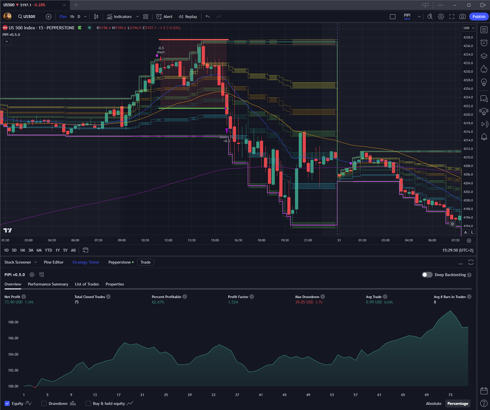

# Short Reversal

This is a simple strategy only using day's High/Low and Fibbonachi looking for day's high short reversal.

## Current results

> See the commit timestamp to know, when the results were last updated. TradingView's Strategy Tester is used for backtesting.

_**(~9 months of backtesting)**_
